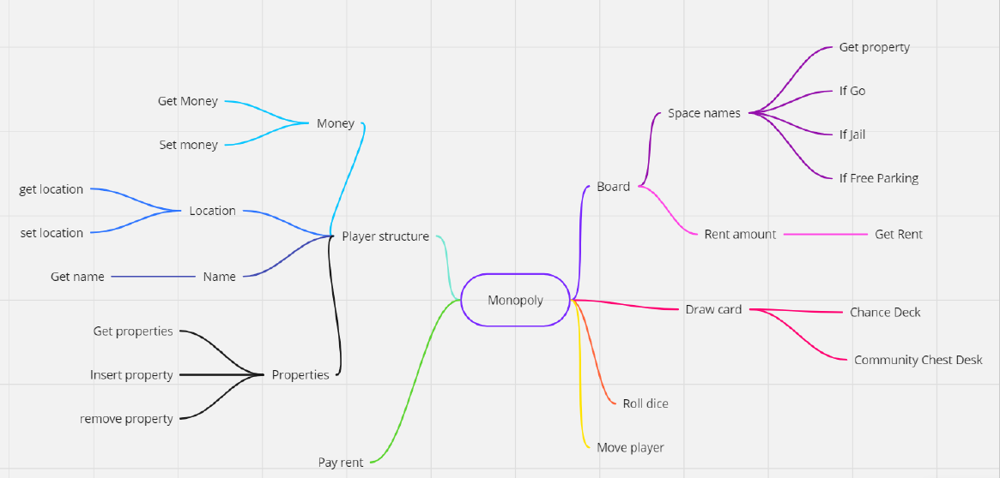

## Project Overview

This project is a simplified Monopoly-style game implemented in C++ using arrays, vectors, and a hash table.

- Hash Table: Stores board information for fast property lookups.
- Vectors: Manage player-owned properties and the chance/community chest card decks.
- Arrays: Track board positions and movement.

The game includes essential Monopoly mechanics such as player movement, property acquisition, and drawing community chest and chance cards. It also tracks each player's balance and updates it based on in-game actions.

## Future Improvements
Due to time constraints, some features were not implemented but are planned for future development:

- Special Spaces: Adding functionality for Jail, Railroads, and Utility spaces.
- Enhanced Gameplay: Implementing auctions, trading, and house/hotel purchases.
- User Interface: Upgrading from a text-based interface to a graphical UI for improved user experience.
